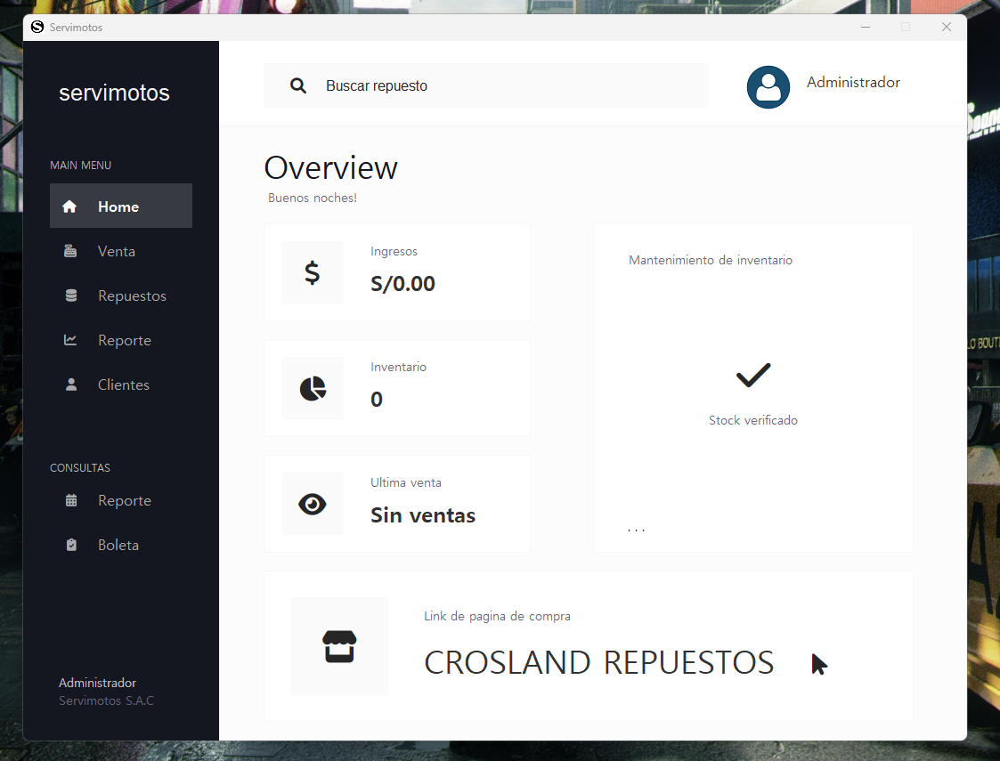

# Sistema para gestionar ventas 

## Captura



## Pasos para poder correr el proyecto localmente

1. Iniciar un servidor local de MySQL (XAMPP, WAMP, MAMP)
2. Ejecutar el archivo script.sql en localhost/phpmyadmin
3. Abrir el proyecto en el IDE de su preferencia
4. Importar los jars necesarios, estos se encuentran dentro de la carpeta jars/
5. Ejecutar el archivo Principal/Main.java

## Cómo obtener el código fuente?

En la sección superior de la página hay un boton verde para poder descargar el zip.

O en caso tenga git instalado en su sistema puede clonarlo:

```bash
git clone https://github.com/juancamr/registro-ventas.git
```